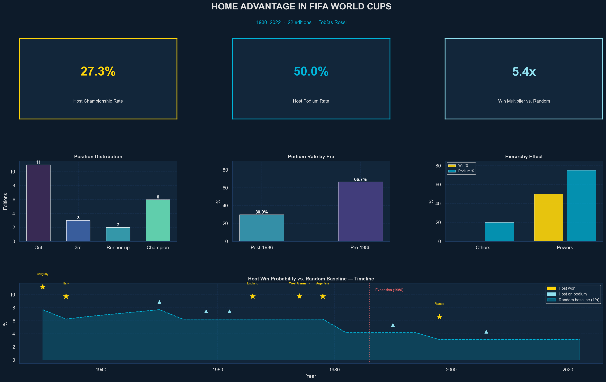

# 🏆 Home Advantage in FIFA World Cups: A Historical Data Analysis

## 📌 Project Overview

This project investigates whether hosting the FIFA World Cup provides a measurable competitive advantage.

Key results show that while host nations historically overperformed, the effect has significantly declined in the modern era. Furthermore, hosting alone does not create champions — it amplifies existing football power.

---

## 🎯 Research Questions

- How often have host nations won the World Cup?
- How frequently do hosts finish in the top 3?
- Has host advantage declined after tournament expansion (post-1986)?
- Is there evidence of structural changes in competitive balance over time?

---

## 📊 Dataset

The dataset contains tournament-level information:

- Year
- Host Nation
- Champion
- Runner-up
- Third Place
- Number of Teams
- Matches Played
- Goals Scored
- Average Goals per Game

---

## 🧠 Methodology

1. Data cleaning and standardization
2. Feature engineering (Host Success Level variable)
3. Era-based comparison:
   - Pre-1986 (smaller tournaments)
   - Post-1986 (expanded format)
4. Comparative analysis of host performance
5. Contextual interpretation of historical trends

---

## 🔎 Key Findings

- Host nations won **27.3%** of all tournaments historically.
- Hosts reached the podium in **50.0%** of World Cups.
- Host podium probability declined from **66.7%** (Pre-1986) to **30.0%** (Post-1986).
- 100% of host champions were already historical football powers.
- Modern tournaments show a clear decline in host dominance.

This suggests that globalization, professionalization, and tournament expansion may have reduced structural home advantage. Hosting acts as a performance amplifier, not a performance creator.

---

## ⚠️ Limitations

- Dataset is aggregated at tournament level.
- No match-level or team-level performance data.
- No control for FIFA rankings or squad strength.
- Limited sample size (22 tournaments).

---

## 🚀 Future Improvements

- Add match-level dataset.
- Include FIFA ranking prior to tournament.
- Perform statistical significance testing (Chi-square).
- Build interactive dashboard (Streamlit / Tableau).

---

## 🛠️ Tools Used

- Python
- Pandas
- NumPy
- Matplotlib/Seaborn
- Jupyter Notebook

---

## 👤 Author

Tobías Rossi