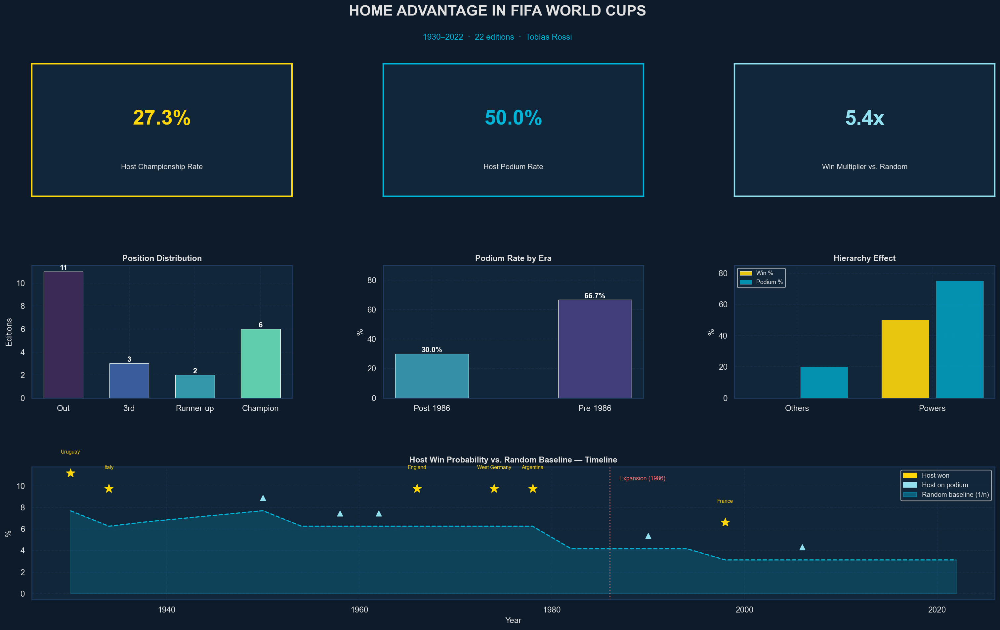

# Home Advantage in FIFA World Cups
### Historical analysis · 1930–2022 · 22 editions



Does hosting the World Cup translate into competitive success — and has that changed over time?

---

## Findings

- Hosts win the title at **27.3%** — roughly **6x the random baseline** for a 32-team field.
- Podium probability dropped from **66.7%** (Pre-1986) to **30.0%** (Post-1986).
- **100% of host champions were historical football powers.** Non-powers have never won as hosts.
- The win multiplier fell from ~10x to ~3x after tournament expansion, suggesting globalization and competitive depth have eroded the structural home advantage.

Core conclusion: home advantage amplifies existing quality. It doesn't substitute for it.

---

## Methodology

Tournament-level data (1930–2022). Key decisions:

- **1986 as era cutoff** — marks the expansion from 16 to 24/32 teams, the most significant structural change in tournament history.
- **Advantage multiplier** — host win rate divided by the average random baseline (1/n teams), to contextualize raw percentages against field size.
- **Historical powers** defined as nations with at least one World Cup title prior to the edition analyzed: Brazil, Germany, Italy, Argentina, France, Uruguay, England, Spain.
- **Fisher's Exact test** used over Chi-square given n=22; results are exploratory, not confirmatory.

---

## Dataset

`FIFA - World Cup Summary.csv` — tournament-level data including host, champion, runner-up, third place, number of teams, matches played, goals scored and average goals per game.

Source: publicly available FIFA historical records.

---

## Usage

```bash
pip install pandas numpy matplotlib seaborn scipy
jupyter notebook Home_Advantage_in_FIFA_World_Cups_v2.ipynb
```

---

## Limitations

- No match-level data (goals, possession, xG per game).
- No pre-tournament quality control (FIFA rankings, squad strength).
- n=22 limits statistical power — findings should be treated as descriptive.

---

## Stack

Python · Pandas · NumPy · Matplotlib · Seaborn · SciPy · Jupyter

---

Tobías Rossi
